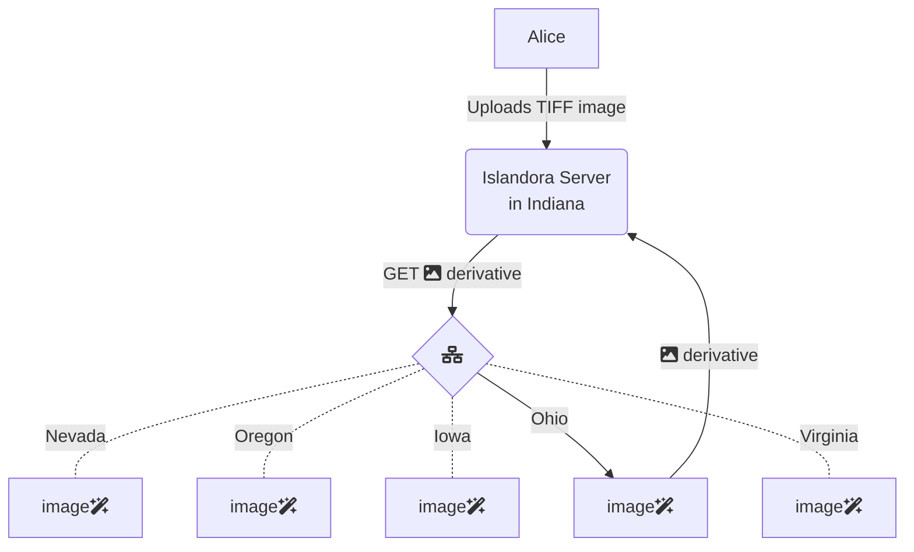

# islandora-microservices

Your Islandora instance can leverage [the Crayfish microservices](https://github.com/islandora/crayfish) running in the Cloud. 

## How it works

The microservices are running in multiple regions, and your microservice requests will route to the region closest to your Islandora server.



## Install

To use these services, in your ISLE `docker-compose.yml` you can point to the Cloud Run deployments to perform your derivative generation.

```
    alpaca-prod: &alpaca-prod
        <<: [*prod, *alpaca]
        environment:
            ALPACA_DERIVATIVE_FITS_URL: https://microservice.libops.site/crayfits
            ALPACA_DERIVATIVE_HOMARUS_URL: https://microservice.libops.site/homarus
            ALPACA_DERIVATIVE_HOUDINI_URL: https://microservice.libops.site/houdini
            ALPACA_DERIVATIVE_OCR_URL: https://microservice.libops.site/hypercube
```

Your files must be accessible over the WWW in order to use this.
