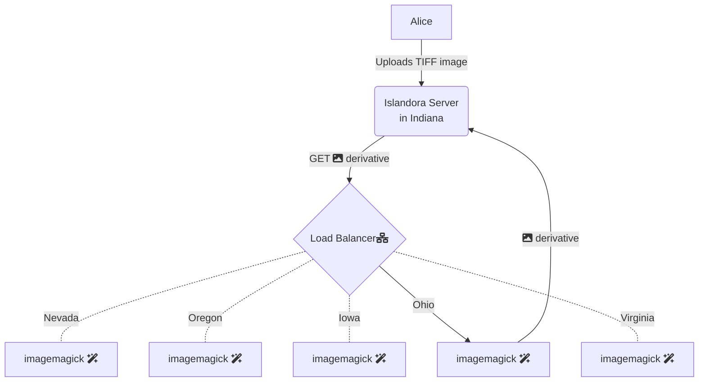

# Horizontally autoscaled derivative creation

Your Islandora instance can leverage the suite of Islandora microservices running in the Cloud. Image derivatives, video derivatives, OCR, hOCR, FITS metadata generated on media uploaded to your repository. Autoscaled to meet the needs of your repository during times of heavy ingestion.

## How it works

The microservices are running in multiple regions, and your microservice requests will route to the region closest to your Islandora server.



## Install

To use these services, in your ISLE `docker-compose.yml` you can point to the Cloud Run deployments to perform your derivative generation.

```
    alpaca-prod: &alpaca-prod
        <<: [*prod, *alpaca]
        environment:
            ALPACA_DERIVATIVE_FITS_URL: https://microservice.libops.site/crayfits
            ALPACA_DERIVATIVE_HOMARUS_URL: https://microservice.libops.site/homarus
            ALPACA_DERIVATIVE_HOUDINI_URL: https://microservice.libops.site/houdini
            ALPACA_DERIVATIVE_OCR_URL: https://microservice.libops.site/hypercube
```

Your files must be accessible over the WWW in order to use this.

You could then remove the crayfits, fits, houdini, hypercube, and homarus services from your ISLE deployment. This should allow you to grant those saved compute resources to other ISLE services. One great way to reallocate some of those resources would be increasing the number of php-fpm workers on your Islandora Drupal site in order to take full advantage of the auto scaled derivative generation.
