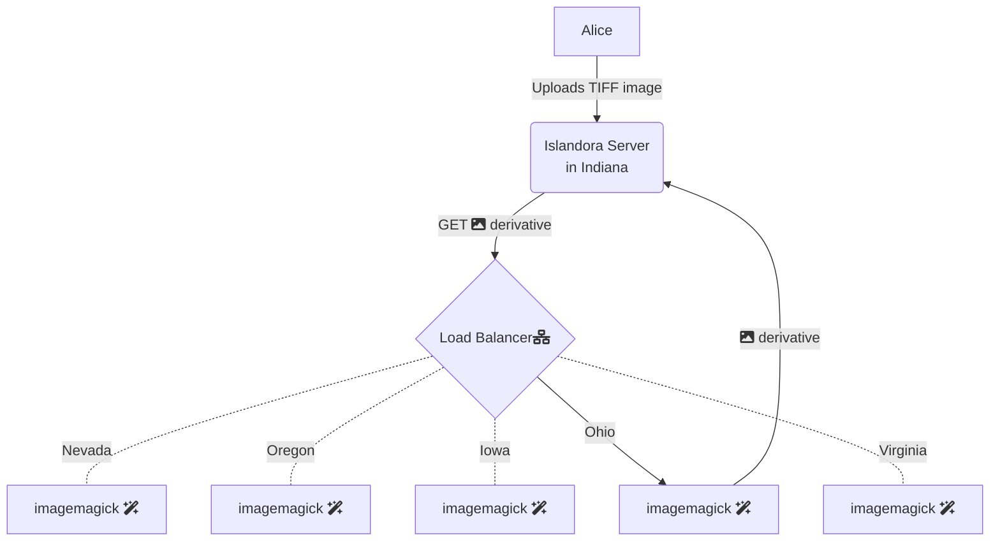

# Multi-region, horizontally autoscaled Islandora microservices

Your Islandora instance can use the Islandora microservices that are fully managed by this repository. Image derivatives, video derivatives, OCR, hOCR, FITS metadata all can be generated on media uploaded to your repository by this service. All the services are set to autoscale to meet the needs of your repository during times of heavy ingestion or migrations.

## How it works

The microservices are running in multiple regions, and your microservice requests will route to the region closest to your Islandora server (though if your nearest region is experiencing an outage, your request will route to an available region).



## Services Available

- https://microservices.libops.site/crayfits
  - [Harvard File Information Toolset (FITS)](https://github.com/harvard-lts/fits)
- https://microservices.libops.site/homarus
  - ffmpeg
    - audio/*
    - video/*
- https://microservices.libops.site/houdini
  - Imagemagick
    - image/*
- https://microservices.libops.site/hypercube
  - tesseract
    - application/pdf
    - image/*
- https://microservices.libops.site/libreoffice
  - libreoffice - convert microsoft documents to PDF
- https://microservices.libops.site/ocrpdf
  - add OCR to a PDF with no OCR
- https://microservices.libops.site/pandoc
  - [Pandoc](https://pandoc.org/) - convert various file formats using pandoc
- https://microservices.libops.site/whisper
  - OpenAI Whisper to generate VTT transcript files from audio and video
    - audio/*
    - video/*

## Regions available

All services are available in all regions (except OpenAI Whisper, which is only in us-central1 due to GPU support)

| Region Name                 | City/Area                   |
|-----------------------------|-----------------------------|
| **us-east4**                | Ashburn, Virginia           |
| **us-east5**                | Columbus, Ohio              |
| **us-central1**             | Council Bluffs, Iowa        |
| **us-west3**                | Salt Lake City, Utah        |
| **us-west1**                | The Dalles, Oregon          |
| **us-west4**                | Las Vegas, Nevada           |
| **us-south1**               | Dallas, Texas               |
| **northamerica-northeast1** | Montréal, Québec, Canada    |
| **northamerica-northeast2** | Toronto, Ontario, Canada    |
| **australia-southeast1**    | Sydney, New South Wales     |
| **australia-southeast2**    | Melbourne, Victoria         |


## Install

To use these managed service, in your ISLE `docker-compose.yml` you can point to the respective service to have it perform your derivative generation.

```
    alpaca-prod: &alpaca-prod
        <<: [*prod, *alpaca]
        environment:
            ALPACA_DERIVATIVE_FITS_URL: https://microservices.libops.site/crayfits
            ALPACA_DERIVATIVE_HOMARUS_URL: https://microservices.libops.site/homarus
            ALPACA_DERIVATIVE_HOUDINI_URL: https://microservices.libops.site/houdini
            ALPACA_DERIVATIVE_OCR_URL: https://microservices.libops.site/hypercube
```

Your files must have a network route over the WWW in order to use this service (or at least from Google Cloud to your Islandora Server). For private files, Islandora handles sending the proper authentication token to allow this service to process your files.

### Post Install

You could then remove the crayfits, fits, houdini, hypercube, and homarus services from your production ISLE deployment. This should allow you to grant those saved compute resources to other ISLE services. One great way to reallocate some of those resources would be increasing the number of php-fpm workers on your Islandora Drupal site in order to take full advantage of the auto scaled derivative generation.

## Monitoring

A VALE dashboard for this service is available at https://www.libops.io/microservices
